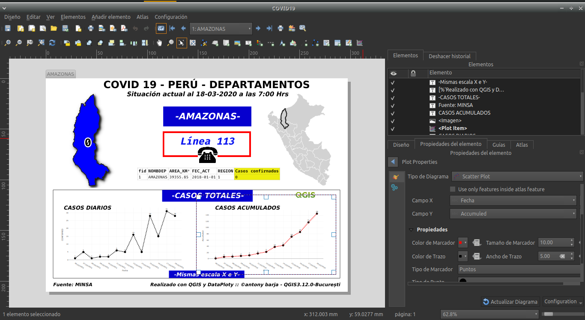
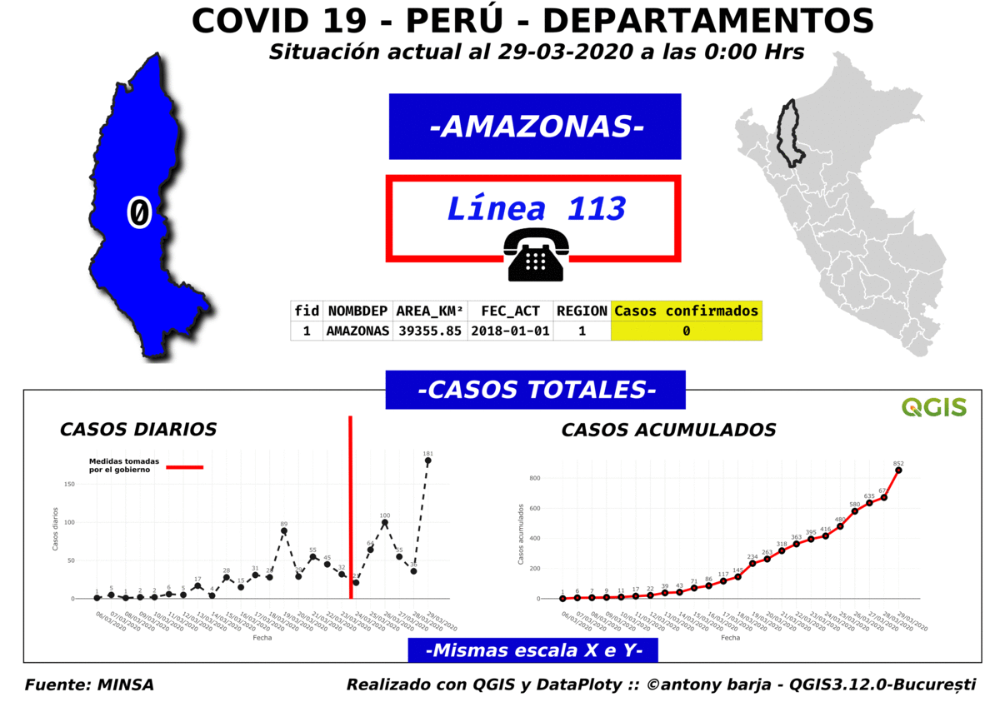

# COVID19PER :peru:
Este presente proyecto tiene cómo finalidad tratar de coloborar con la difusión y el análisis espacial de los casos confirmados por la presencia del **COVID-19** en los respectivos departamentos del Perú, los datos que se emplearon para elaborar el presente mapa fueron recopilados de las respectivas autoridades encargadas de la presente temática, en este caso los datos fueron tomados de los diferentes reportes que fuerón publicados en **Twitter** por el ["Ministerio de Salud"](https://twitter.com/Minsa_Peru).

## Atlas
Vector de referencia : layer `Confirmed_COVID19PER`

**Gif animación:**

## Referencias utilizadas:
- **QGIS** : <https://qgis.org/it/site/>
- **Plugin DataPlotly** : <https://plugins.qgis.org/plugins/DataPlotly/>
- **Ministerio de Salud (Minsa)** : <https://twitter.com/Minsa_Peru>
- **Salvatore Fiandaca (pigreco)**: <https://github.com/pigreco/COVID-19_ITA>
- **Jesus M. Castagnetto(jmcastagnetto)**: <https://github.com/jmcastagnetto/covid-19-peru-data>

Todos los datos producidos en el presente proyecto se publican bajo [licencia Creative Commons (CC BY 3.0 IT)](https://creativecommons.org/share-your-work/): Es posible reproducir, distribuir, transmitir y adaptar libremente datos,  también con fines comerciales, siempre que se cite la **fuente**.

