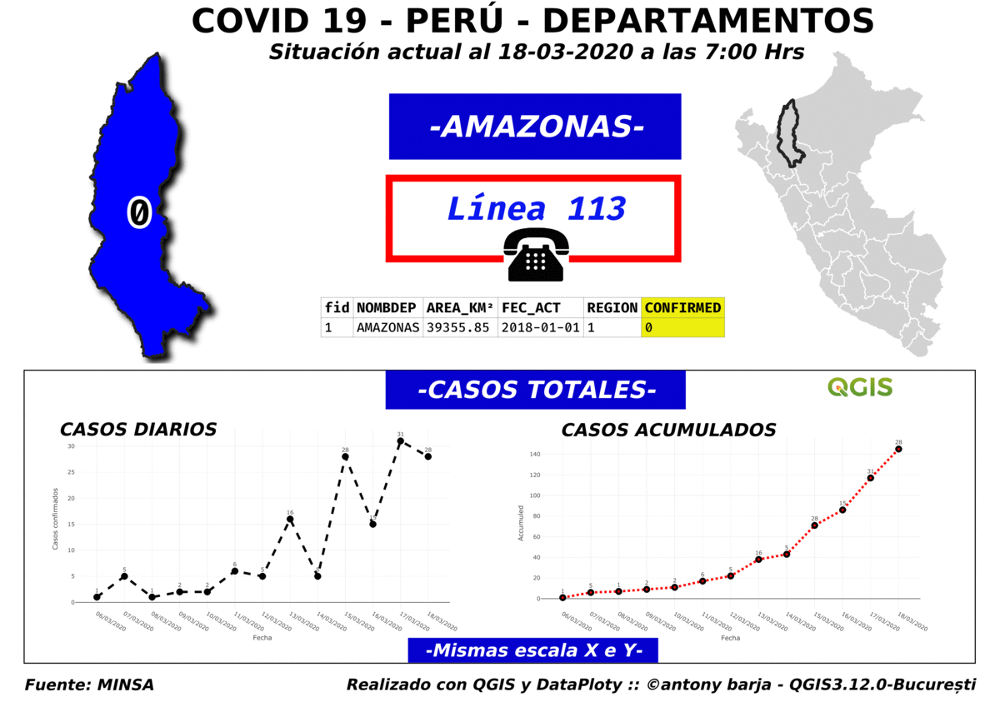

# COVID19PER
Este presente proyecto tiene cómo finalidad tratar de coloborar con la difusión y analisis espacial 

## Atlas

Vector de referencia : layer `Confirmed_COVID19PER`

**Gif animación:**

## Referencias utilizadas:
- **QGIS** : <https://qgis.org/it/site/>
- **Plugin DataPlotly** : <https://plugins.qgis.org/plugins/DataPlotly/>
- **Ministerio de Salud (Minsa)** : <https://github.com/pcm-dpc/COVID-19>
- **Salvatore Fiandaca (pigreco)**: <https://github.com/pigreco/COVID-19_ITA>

